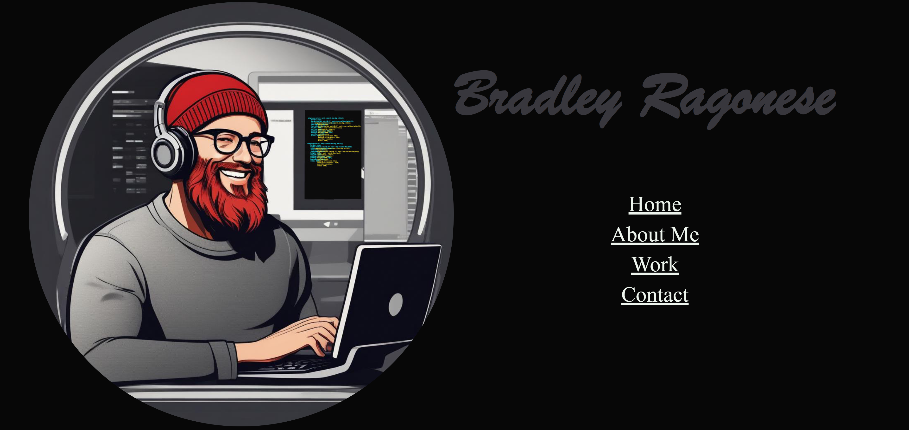
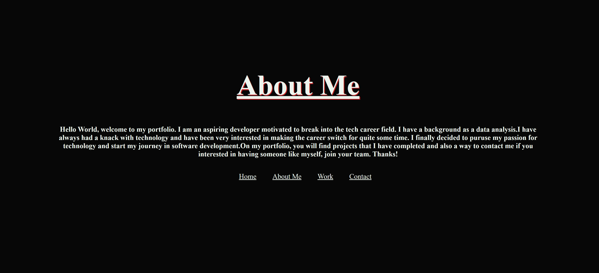
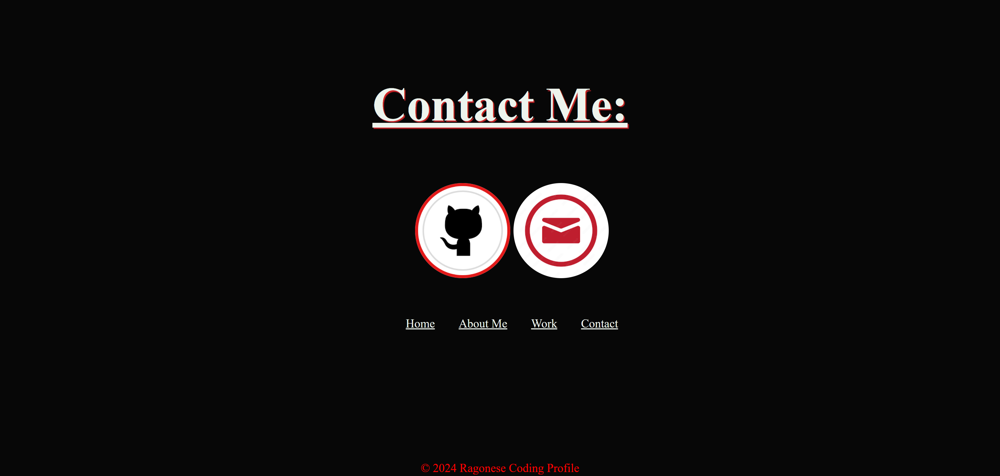

# My Portfolio

## Description

This webpage is a portfolio that was created to store my projects for employers who are looking for examples of my work. There are navigation links that will take you to different sections of my portfolio including an about me section, my project section, and a way to contact me. If you click the project images, they will take you to the project itself. Also, in the contact portion there are two clickable buttons that will take you to my github and also to my email address.

## Links

- https://bragonese1.github.io/my-portfolio/#home
- https://github.com/bragonese1/my-portfolio

## Installation

This page was created using HTML and CSS. It was upload to github and deployed.

## Usage

Use the navigation links to explore my portfolio and find out more about me and my work.

## Screenshot of Portfolio Page

